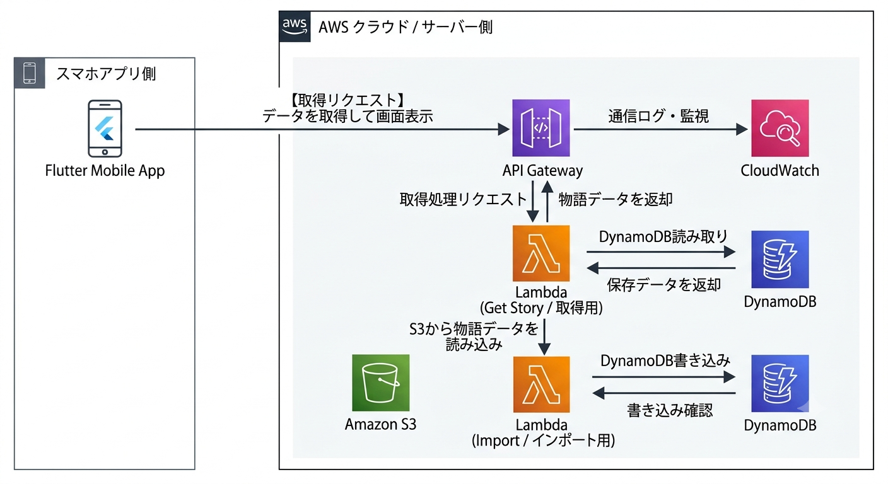

## 概念図

## CI/CD
### CD
- GitHub Actionsによる自動デプロイ
   - developブランチにマージされた瞬間にTestFlightに自動デプロイ

# Driftのビルド
`flutter pub run build_runner build`

# MEMO
## 子Widgetでcontextで受け取るか、引数で渡すかの判断

1. このWidgetはビジネスロジックに依存しているか？  
   → Yes → 引数で受け取る  
   → No → 次へ  

2. このWidgetは再利用されるか？  
   → Yes → 引数で受け取る  
   → No → 次へ  

3. このWidgetはテスト対象か？  
   → Yes → 引数で受け取る  
   → No → context.read() でもOK  
